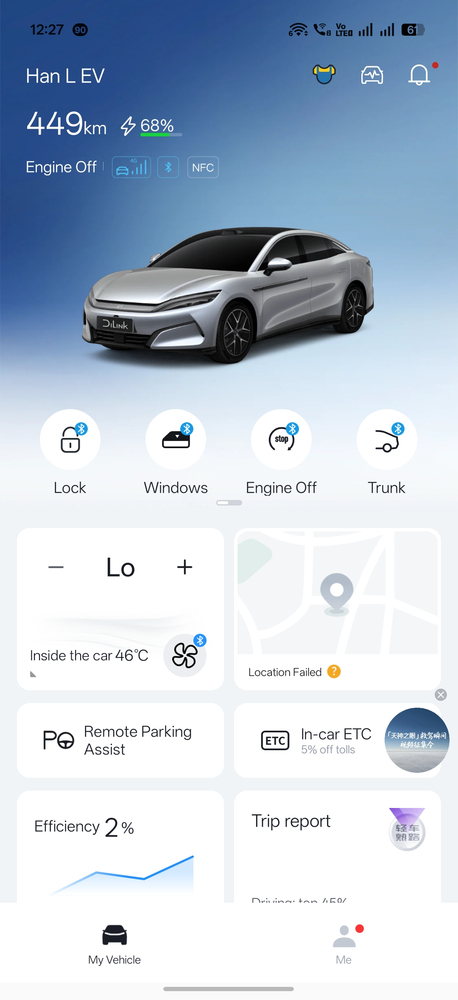
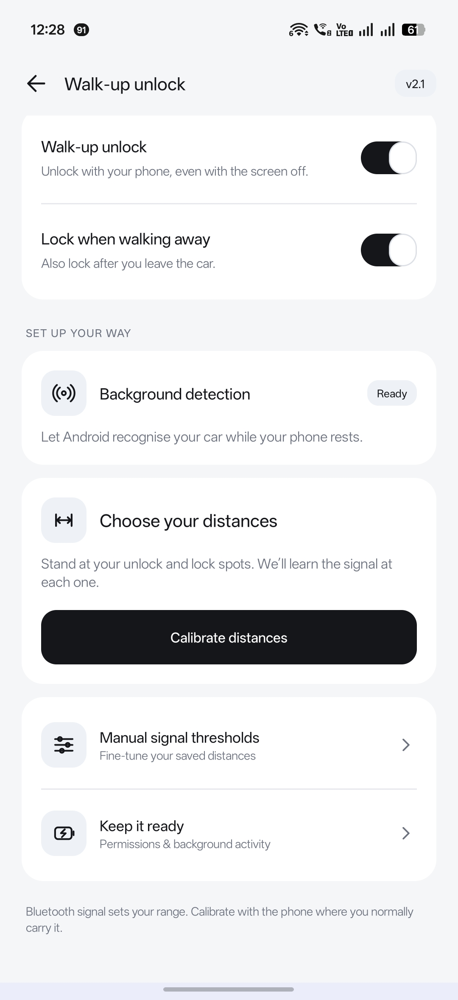
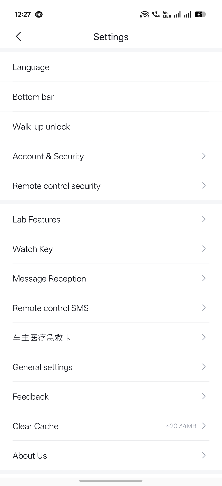
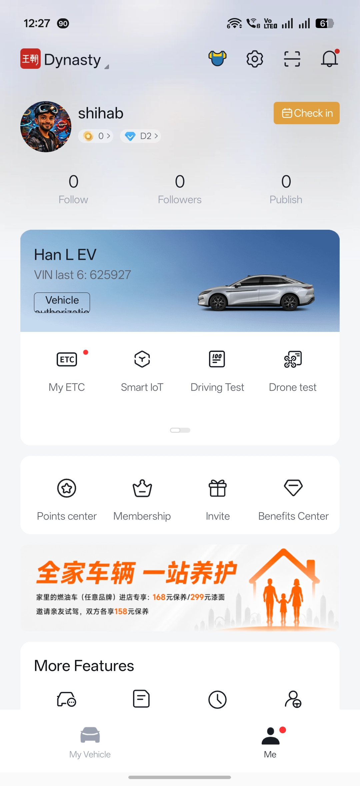

# BYD Android Localized

[English](README.md) · [العربية](README.ar.md) · [Русский](README.ru.md)

**BYD Android 9.16.1 · Actualización de septiembre de 2026**

Actualización pública del BYD Android traducido. Descarga el APK o visita la página de descarga.

[**Descargar APK**](https://github.com/shihabal3amri/BYD-Android/releases/download/v9.16.1-20260914/BYD-Android_9.16.1_20260914.apk) · [BYD Android traducido · Descargar](https://shihabal3amri.github.io/BYD-Android/es/) · [Informar de un problema](https://github.com/shihabal3amri/BYD-Android/issues/new?template=bug-report.yml)

## Novedades de esta versión

- BYD 9.16.1 con inglés, árabe, ruso, español y modo de texto original en chino simplificado.
- Paquetes de traducción firmados: actualización manual independiente y actualización automática desactivada por defecto. Cierra completamente BYD y vuelve a abrirla para aplicar.
- Panel de traducciones renovado, con diseño de derecha a izquierda para árabe y fecha de última comprobación en el idioma elegido.
- Correcciones de traducción, incluidos mensajes de reenvío de códigos, manteniendo las funciones de proximidad y cámaras existentes.
- Se conservan la calibración, el bloqueo opcional al alejarse y las pestañas personalizables; no se cambia la versión de la función de proximidad.

## Dentro de la aplicación

<a href="assets/dashboard.jpg"></a>
<a href="assets/walkup-setup.jpg"></a>
<a href="assets/settings.jpg"></a>
<a href="assets/profile.jpg"></a>

## 1. Instala o actualiza

1. Descarga el APK en tu teléfono Android y abre el archivo.
2. Si Android lo solicita, permite a ese navegador o gestor de archivos instalar aplicaciones y sigue las instrucciones.
3. Abre BYD e inicia sesión con tu cuenta. En Yo → Ajustes puedes elegir idioma y pestañas.

¿Actualizas una versión compatible del proyecto? Conserva la aplicación e instala encima para mantener los ajustes locales. Se utiliza la misma clave de firma del proyecto; puede ser necesario iniciar sesión de nuevo.

Si usas la aplicación original de BYD, desinstálala primero porque las firmas difieren. Esto elimina sus datos locales; puede que debas iniciar sesión y configurar de nuevo la llave Bluetooth.

## 2. Configura el desbloqueo por proximidad

1. Confirma que tu llave Bluetooth BYD puede bloquear y desbloquear el coche manualmente.
2. Abre Yo → Ajustes → Desbloqueo por proximidad y activa la función. Permite el acceso a dispositivos cercanos y mantén Bluetooth encendido.
3. En Detección en segundo plano, sigue las instrucciones para tu llave. Las llaves compatibles de dirección fija usan la configuración de detección del coche de Android; las de dirección variable usan detección de emisiones.
4. Pulsa Calibrar distancias. Mide las posiciones de desbloqueo y bloqueo llevando el teléfono como de costumbre y guarda.
5. Activa Bloquear al alejarse si lo deseas. Usa Mantener preparado para configurar la actividad en segundo plano del teléfono.

Puedes seguir usando umbrales manuales. La calibración pausa las acciones automáticas. Los bolsillos y el entorno afectan a la señal; no es una medición exacta en metros.

## Compatibilidad y comentarios

Requiere un teléfono Android ARM de 64 bits. La detección Bluetooth añadida usa API de Android 8 o posterior; la detección Companion requiere Android 12 o posterior y soporte del dispositivo. El desbloqueo automático necesita una llave Bluetooth BYD funcional.

El español sigue en revisión. Algunos contenidos e imágenes permanecen en chino. El funcionamiento en segundo plano y las funciones disponibles dependen del teléfono y del coche. Tras forzar el cierre, abre BYD para reanudar la detección. Las cámaras dependen del vehículo y del servicio BYD.

Incluye teléfono, versión de Android, modelo del coche, versión de la aplicación y pasos para reproducir el problema. Retira datos de cuenta, VIN y ubicaciones de las capturas y registros.

## Descargas y verificación

[Notas y sumas de verificación](https://github.com/shihabal3amri/BYD-Android/releases/tag/v9.16.1-20260914) · [release.json](release.json)

`BYD-Android_9.16.1_20260914.apk` · 375,288,531 bytes

SHA-256: `b41484116028f751774d51f42f108be7aed39afd136f22bfa324026d587beca1`

## Mantenimiento de esta página

Update `release.json` and `content/*.json`, then run:

```sh
python scripts/build_site.py
python scripts/validate_site.py
```

APK downloads belong in GitHub Releases. This repository contains the download
page, screenshots, instructions and issue templates. It does not contain the
original BYD app source, signing keys, user logs or account data.

Proyecto no oficial, sin afiliación ni respaldo de BYD. La aplicación y los recursos originales pertenecen a sus propietarios.
